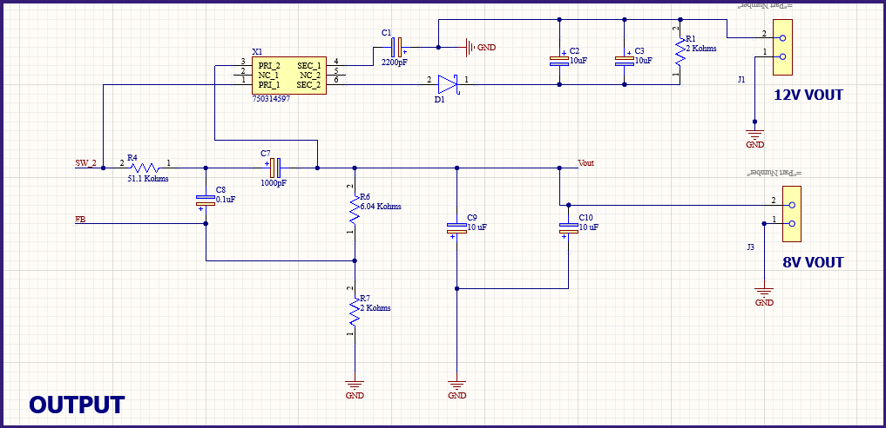
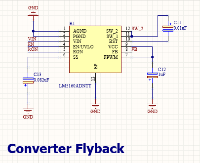
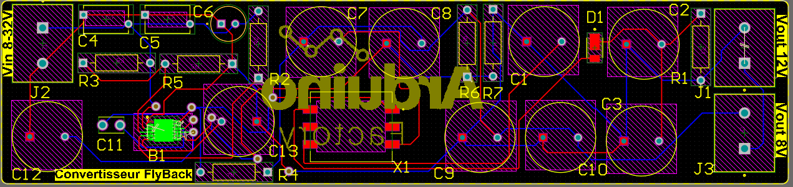
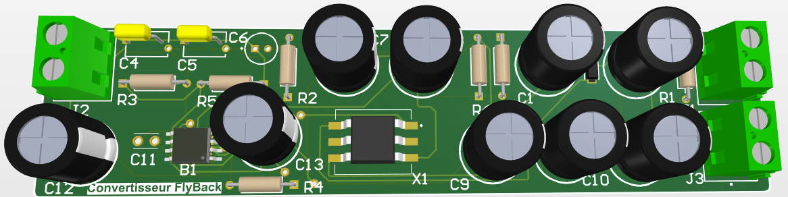

# FlyBack-Converter-PCB-Board

The FlyBack converter converts one DC voltage and another DC voltage reduced in relation to the input voltage. It enables electronic components to be supplied at their operating voltage from an AC/DC converter, for example.

The flyback converter is probably the most widely used structure in the electronics industry (LCD monitors, CRT televisions, DVD players, etc.). It's the equivalent of a Buck-Boost converter in which the inductor has been replaced by two coupled inductors acting as transformers.
The operating principle of the Flyback converter is based on storing energy in the magnetic core of a transformer during the first phase of the switching cycle, and releasing this energy to the output during the second phase. This method of transferring energy via a transformer provides not only electrical isolation, but also great flexibility in the choice of input and output voltages.

*Project duration: 2 days*

# Table of contents
- [Electronic diagram](#electronic-diagram)
- [PCB Design](#pcb-design)
  

## Electronic diagram

In this lesson, we'll be building our own FlyBack converter from the basic circuit diagram to convert a DC voltage between 8V and 32V into two DC output voltages: 8V and 12V. 

Here's our circuit diagram, which we'll detail below:

 

The C4, C5, and C6 on the input are used for filtration of the input supply. Whereas R3 and R5 are used for the Under voltage lockout related purposes. 
Input elements C4, C5 and C6 are used for input power filtering.
The R2 resistor is for the On time related purpose :
 

R4, C5 and C9 are the ripple filter where as R8 and R9 providing the feedback voltage to the feedback pin of the LM5160. This two resistors ration determine the output voltage. C10 and C11 are used for primary non isolated output filteration.

A major component is the T1. It is a coupled inductor with a 60uH inductor on both sides, primary and secondary. 

 

C13 capacitor connected across the SS pin is a soft start capacitor. The AGND (Analog Ground) and PGND (Power Ground) and the PAD is connected with the supply GND. On the Right side, C11, 0.01 uF capacitor is a Bootstrap capacitor which is used for the biasing of the gate driver. 

 

## PCB Design

The PCB was created using Altium Designer. It's a two-layer board produced by JLPCB (Easy Eda). We followed the recommendations found in the datasheet for the FlyBack converter (LM5160ADNTT) or the board's electronic schematic and routing.

Here's the top layer view of the PCB:

 

Here is a 3d view of the PCB:

 

## Arduino Factory

 * [More details on this project](https://arduinofactory.fr/carte-pcb-convertisseur-flyback/)
  

